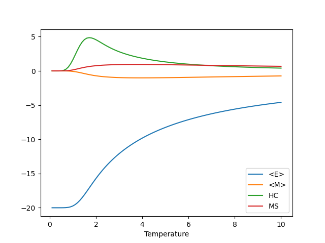

Getting Started
===============

This page details how to get started with freevirgil. 

Installation
------------
Requirements:

* **Python3**

Install by exectuting:
::

    pip install git+https://github.com/zacc23/freevirgil.git

or

::

    git clone https://github.com/zacc23/freevirgil.git
    cd freevirgil
    pip install .

References
----------

**Gibbs Distribution**

:math:`P(\alpha) = e^{-E(\alpha)/kT}` with Boltzmann constant, :math:`k = 1.38064852 \times 10^{-23} J/K` and a temperature `T` in Kelvin

This gives the probability of observing each particular spin :math:`\alpha`.

**Ising Hamiltonian**

Energy: :math:`\displaystyle\hat{H}' = \frac{\hat{H}}{k} = -\frac{J}{k}\sum_{<ij>} s_is_j + \tfrac{\mu}{k}\sum_i s_i,`
where :math:`s_i = 1` if the :math:`i^{th}` spin is `up` and :math:`s_i = -1` if it is `down`

Magnetization: :math:`M(\alpha) = N_{\text{up}}(\alpha) - N_{\text{down}}(\alpha)`.

This is the 

**Averages**

:math:`\left<M\right> = \sum_\alpha M(\alpha)P(\alpha)`.

:math:`\left<E\right> = \sum_\alpha E(\alpha)P(\alpha)`.

Examples
--------

**Plot** 

.. literalinclude:: ../examples/plot.py

